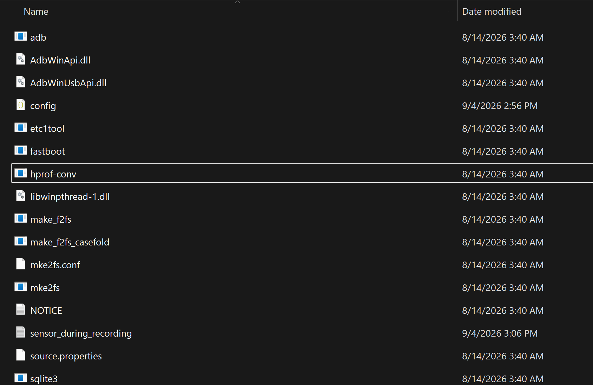
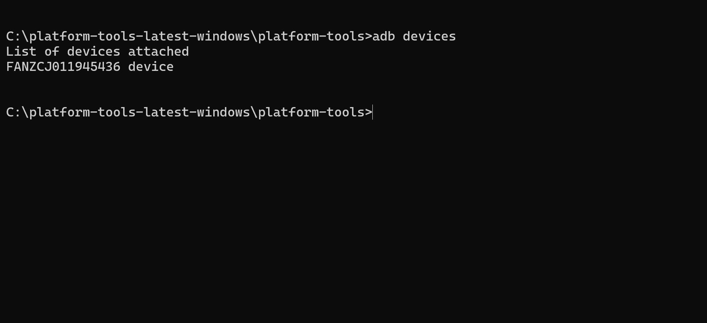
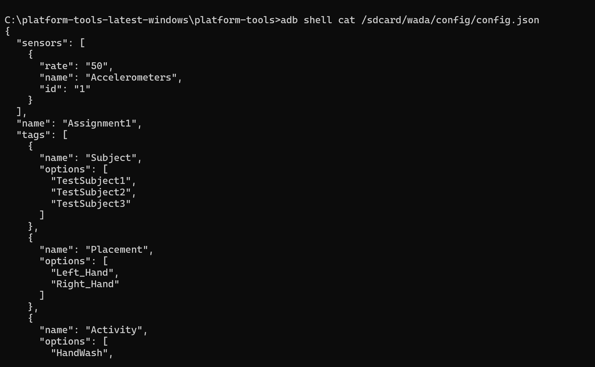

# Smart Watches

## Overview

This repository walks you through setting up your smartwatch, configuring WADA, and moving data between the watch and your computer.

The screenshots were taken on **Windows**. The steps also work on macOS and Linux, except where noted.

All files referenced below are in the `Contents` folder of this repository.

### Contents

- `Smart Watches, Weka, and Programming Assignment.pptx`: overview of the full process and the tools you'll use
- `setting-debug-to-true`: video showing how to turn on ADB debugging on the watch
- `android tools.png`: the Android Platform Tools download page
- `Download_sdk.png`: where to download the right Platform Tools package
- `Platform-tools-contents.png`: what the extracted `platform-tools` folder should look like
- `open-cmd-from-platform tools.png`: opening Command Prompt inside the `platform-tools` folder
- `adb-devices.png`: expected output of `adb devices`
- `access-config-through-adb.png`: viewing the WADA configuration stored on the watch

### Video demos (Canvas)

- [Setting debug to true](https://canvas.its.virginia.edu/courses/188282/files/folder/SmartWatches/Video%20Demos?preview=20766421): turning on ADB debugging on the watch (Part 1, Step 1)
- [Setting up the GUI](https://canvas.its.virginia.edu/courses/188282/files/folder/SmartWatches/Video%20Demos?preview=20773075): getting the WADA Desktop app running (Path A)
- [Loading an existing configuration](https://canvas.its.virginia.edu/courses/188282/files/folder/SmartWatches/Video%20Demos?preview=20773274): loading and pushing a saved configuration with the desktop app (Path A)
- [Seeing the new configuration on the watch](https://canvas.its.virginia.edu/courses/188282/files/folder/SmartWatches/Video%20Demos?preview=20773151): what changes on the watch after a configuration is pushed

---

## How this guide is organized

WADA is already installed on your watch. Your job is to send it a **configuration** (what to record and how to label it) and later **download the recorded data** to your computer.

Your computer talks to the watch through a small tool called **ADB** (Android Debug Bridge). Everyone needs it, so **Part 1** is the same for everybody.

In **Part 2** you pick one of two ways to manage the watch:

| | **Path A: WADA Desktop app** | **Path B: Commands** |
|---|---|---|
| What it is | A point-and-click window | Typing a few short commands |
| Extra installs | Java + the WADA desktop app | Nothing extra |

Both paths do exactly the same thing. The desktop app just runs the same ADB commands for you behind the buttons, so you don't miss anything by choosing Path B.

> **Note for Mac users:** Path A has not been tested on macOS and may not work properly there. If you run into problems, use Path B.

> **Note:** You'll need Java later in the assignment anyway (for `Wada.jar` and your own program), so installing it now doesn't hurt even if you choose Path B.

---

# Part 1: Setup (everyone)

## Step 1: Turn on ADB debugging on the watch

On the watch, go to:

```text
Settings > Developer Options
```

and enable **ADB debugging**.

If you don't see Developer Options, or you're unsure how to do this, follow the `setting-debug-to-true` video in this repository.

> **Video demo:** [Setting debug to true](https://canvas.its.virginia.edu/courses/188282/files/folder/SmartWatches/Video%20Demos?preview=20766421) (Canvas)

---

## Step 2: Install Android Platform Tools

Platform Tools is a small download that contains ADB.

> You do **not** need Android Studio. It also includes ADB, but it's a very large install you won't otherwise use.

Go to the Android Platform Tools page:

[https://developer.android.com/tools/releases/platform-tools](https://developer.android.com/tools/releases/platform-tools)


Scroll down, choose the download for your operating system, accept the terms, and download the `.zip` file.

Extract it. On Windows, putting it directly on your `C:\` drive keeps things simple:

```text
C:\platform-tools
```

Open the `platform-tools` folder. It should look similar to this:



Make sure you can see `adb` (`adb.exe` on Windows) before continuing.

> **macOS shortcut:** If you use Homebrew, you can skip the download and run `brew install android-platform-tools` instead. Then `adb` works from any Terminal window.

---

## Step 3: Open a terminal in the `platform-tools` folder

You'll run ADB commands from inside this folder.

**Windows**, either:

- Open the `platform-tools` folder in File Explorer, click the address bar, type `cmd`, and press **Enter**, or
- Right-click inside the folder and choose **Open in Terminal** (or **Open command window here**, depending on your Windows version).


**macOS**: right-click the `platform-tools` folder in Finder and choose **New Terminal at Folder**.

> **macOS/Linux note:** When running ADB from inside the folder, type `./adb` instead of `adb` (for example, `./adb devices`). If you installed it with Homebrew, plain `adb` works.

---

## Step 4: Connect and verify the watch

Connect the watch to your computer with the USB cable.

The first time you connect, the watch will ask whether to allow USB debugging. Choose **Always allow from this computer** and approve.

Then run:

```cmd
adb devices
```

You should see something like:

```text
List of devices attached
XXXXXXXXXXXX    device
```



The word `device` next to the serial number means you're connected. If it says `unauthorized`, check the watch screen for the approval prompt and run `adb devices` again.

**Once you see `device`, Part 1 is done.** Move on to Part 2 and pick a path.

---

# Part 2: Choose how to manage the watch

## Path A: WADA Desktop app (recommended on Windows)

> **Note:** This path has not been tested on macOS. If you run into problems on a Mac, use Path B instead.

### A1. Install Java

The desktop app is a Java program.

Download Java (Temurin) from Adoptium:

[https://adoptium.net/](https://adoptium.net/)

Run the installer with the default options. Then close and reopen Command Prompt, and check it worked:

```cmd
java -version
```

You should see version information. If you see `'java' is not recognized...`, close Command Prompt, reopen it, and try again.

### A2. Download the WADA desktop app

Go to the WADA repository:

[https://github.com/abumondol/WaDa](https://github.com/abumondol/WaDa)

Click **Code > Download ZIP**, then extract the ZIP.

Inside, open the `desktop app` folder. You should see:

```text
config.json
pullData.cmd
pushConfig.cmd
WaDa Desktop.jar
```

### A3. Copy the files into `platform-tools`

Copy everything from `desktop app` into your `platform-tools` folder. This lets the desktop app find ADB.

Your folder should now look similar to:

```text
C:\platform-tools
│
├── adb.exe
├── fastboot.exe
├── WaDa Desktop.jar
├── config.json
├── pushConfig.cmd
├── pullData.cmd
└── ...
```

### A4. Open the desktop app

Double-click `WaDa Desktop.jar`.

If nothing happens, open Command Prompt in the `platform-tools` folder and run:

```cmd
java -jar "WaDa Desktop.jar"
```

The app has three tabs: **Home**, **Configuration**, and **Data**.

> **Video demo:** [Setting up the GUI](https://canvas.its.virginia.edu/courses/188282/files/folder/SmartWatches/Video%20Demos?preview=20773075) (Canvas)

### A5. Create and push a configuration

Use the **Configuration** tab to define what the watch records. A configuration includes a name, tags, options for each tag, sensors, and a sampling rate. For example:

```text
Configuration Name: HandWash

Subject:
Student1, Student2

Placement:
Left_Wrist

Activity:
Hand_Wash, No_Hand_Wash
```

Under **Available Sensors**, select **1 Accelerometers** (the sensor this assignment uses).

Choose a sampling rate: **UI**, **Normal**, **Game**, **Fastest**, or **Custom**. With **Custom**, you can type a rate such as `50`.

Click **>>** to move the accelerometer into **Selected Sensors**.

Click **Save** to keep a copy on your computer, then **Push** to send the configuration to the watch.

> The Configuration tab starts out empty. That's normal. Either fill it in or click **Load** to open a saved configuration.

> **Video demos:**
> - [Loading an existing configuration](https://canvas.its.virginia.edu/courses/188282/files/folder/SmartWatches/Video%20Demos?preview=20773274) (Canvas)
> - [Seeing the new configuration on the watch](https://canvas.its.virginia.edu/courses/188282/files/folder/SmartWatches/Video%20Demos?preview=20773151) (Canvas)

### A6. Download your data

After you've recorded data on the watch, use the **Data** tab. Choose the folder on your computer where you want the files saved, then pull the data.

**Path A done.** Skip ahead to Part 3.

---

## Path B: Commands (Windows, macOS, Linux)

Open a terminal in the `platform-tools` folder (see Step 3). Remember: on macOS/Linux, type `./adb` instead of `adb` unless you installed it with Homebrew.

### B1. Check that WADA is installed

Windows:

```cmd
adb shell pm list packages | findstr /i wada
```

macOS/Linux:

```bash
adb shell pm list packages | grep -i wada
```

You should see:

```text
package:edu.virginia.cs.mooncake.wada
```

### B2. Prepare your configuration file

The configuration is a file called `config.json`. Start from the one provided (or one from your instructor), edit it in any text editor, and save it inside your `platform-tools` folder.

### B3. Push the configuration to the watch

```cmd
adb push config.json /sdcard/wada/config/config.json
```

### B4. Check the configuration on the watch

```cmd
adb shell cat /sdcard/wada/config/config.json
```

Your configuration should print in the terminal.



### B5. Restart WADA so it loads the new configuration

```cmd
adb shell am force-stop edu.virginia.cs.mooncake.wada
```

Then open WADA again on the watch.

> **Video demo:** [Seeing the new configuration on the watch](https://canvas.its.virginia.edu/courses/188282/files/folder/SmartWatches/Video%20Demos?preview=20773151) (Canvas)

### B6. See your recorded files

After recording, list the files on the watch:

```cmd
adb shell ls -la /sdcard/wada/data
```

### B7. Download your data

Download everything at once:

```cmd
adb pull /sdcard/wada/data
```

Or just one file:

```cmd
adb pull /sdcard/wada/data/FILENAME
```

replacing `FILENAME` with the real name, for example:

```cmd
adb pull /sdcard/wada/data/example.wada
```

Files are saved in the folder where you ran the command.

---

# Part 3: The full workflow

```text
Part 1 (everyone)
  Turn on ADB debugging
        ↓
  Install Platform Tools
        ↓
  Connect watch, run adb devices

Part 2 (pick one)
  Path A: Java + WADA Desktop app     OR     Path B: Commands
        ↓
  Push configuration
        ↓
  Restart / open WADA on the watch
        ↓
  Record data (START / STOP on the watch)
        ↓
  Pull data to your computer
        ↓
  Process the .wada files (assignment)
```

## How this connects to the assignment

```text
.wada files
        ↓
Wada.jar
        ↓
Accelerometer CSV files
        ↓
Your Java program
        ↓
1-second windows
        ↓
Feature extraction
        ↓
features.csv
        ↓
Wada.jar
        ↓
features.arff
        ↓
WEKA
        ↓
Decision tree classification
```

The raw WADA files may contain other sensors, but Assignment 1 uses only the **accelerometer** data.

## Three different WADA tools

These are easy to mix up:

- **WADA watch app** runs on the watch. Use it to START and STOP recording, choose labels, and store the sensor data.
- **WADA Desktop app** runs on your computer (Path A only). Use it to create and push configurations and download recordings.
- **Wada.jar** runs on your computer after data collection. Use it to extract accelerometer data from `.wada` files and to convert CSV feature files to ARFF.

---

# Troubleshooting

## `adb` is not recognized / command not found

Make sure your terminal is open inside the `platform-tools` folder and that `adb` is in it. On macOS/Linux, use `./adb`.

## Device shows as `unauthorized`

Look at the watch screen, choose **Always allow from this computer**, approve, and run `adb devices` again.

## No device appears under `adb devices`

Check that:

- the watch is plugged in
- the USB cable supports data (some cables are charge-only)
- ADB debugging is on
- you approved the computer on the watch

Then unplug and reconnect the watch.

## `java` is not recognized (Path A)

Close and reopen Command Prompt, then run `java -version`. If it still fails, restart your computer.

## WADA Desktop app doesn't open (Path A)

Open Command Prompt in the folder with `WaDa Desktop.jar` and run:

```cmd
java -jar "WaDa Desktop.jar"
```

Any errors will show in the terminal.

## The configuration didn't change on the watch

Check what's on the watch:

```cmd
adb shell cat /sdcard/wada/config/config.json
```

If it's correct, restart WADA:

```cmd
adb shell am force-stop edu.virginia.cs.mooncake.wada
```

and reopen it on the watch.

## The desktop app isn't working on a Mac

Path A hasn't been tested on macOS. Use the Path B commands instead; they do the same thing.

---

# Quick reference

| Task | Command |
|---|---|
| Check the watch is connected | `adb devices` |
| Check WADA is installed (Windows) | `adb shell pm list packages \| findstr /i wada` |
| Check WADA is installed (macOS/Linux) | `adb shell pm list packages \| grep -i wada` |
| Push configuration | `adb push config.json /sdcard/wada/config/config.json` |
| View configuration | `adb shell cat /sdcard/wada/config/config.json` |
| Restart WADA | `adb shell am force-stop edu.virginia.cs.mooncake.wada` |
| List recorded files | `adb shell ls -la /sdcard/wada/data` |
| Pull one file | `adb pull /sdcard/wada/data/FILENAME` |
| Pull all data | `adb pull /sdcard/wada/data` |
| Open the desktop app (Path A) | `java -jar "WaDa Desktop.jar"` |